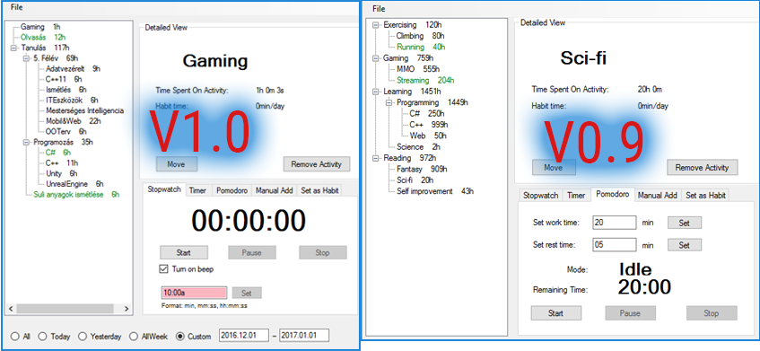

# HourCounter
Counts how many hours you spend on activities.

Demo
=================================

Features
=================================
1. Managing Activities
	1. Tree structure for better categorization
	2. Detailed view of your activity ( More details coming soon )
	3. Different counting methods
		1. Pomodoro
		2. Casual Timer
		3. Stopwatch
		4. Manual add
		5. Daily add (Habbit)
	4. Habbit system
		1. You can set activities as habbits with a specified time which you spend on them daily
		2. The program will popup everyday your habbits, and you can add these times easily to your desired activity
2. Google Drive support for saving
3. Settings 

Compile
=================================

1. VS2015 .Net Framework 4.5.2
2. Download packages
	1. Download by hand
		1. Download Google Drive API 
		    * NuGet package manager : Install-Package Google.Apis.Drive.v3 GoogleDrive
			* <a href="https://www.nuget.org/packages/Google.Apis.Drive.v3/">Google.Apis.Drive.v3</a>
		2. Download MimeType converter
			* NuGet package manager : Install-Package MediaTypeMap GoogleDrive
	
	2. or Allow NuGet to download missing packages during build
			
3. Build Solution

Future Plans
=================================

1. Add Google Calendar support
2. Motivation music
3. Improved serialization
4. Add support for daily time management
5. Many more

Also if you want to join developing this application, feel free to email me.
